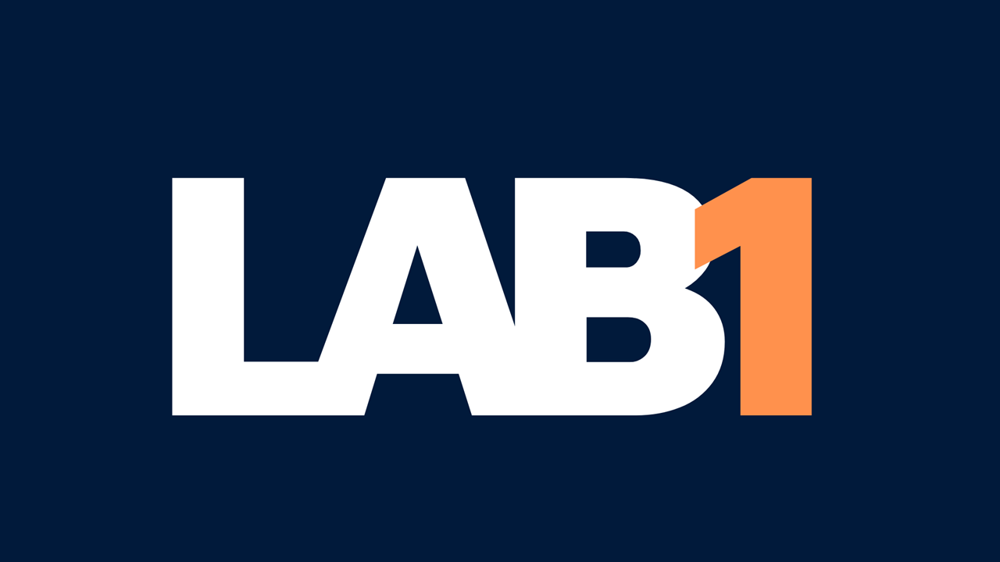

Hi! I'm Oani (you can pronounce it like "1e")

Studying and coding, now and always. 
Analyst and Developmer of systems (FATEC - Sorocaba)(2022). 
Physicist (UNESP)(2015) and Master in Psychology (UFSCar)(2019).

Currently working with C# development for SAP technologies and fullstack development using Blazor.

 
